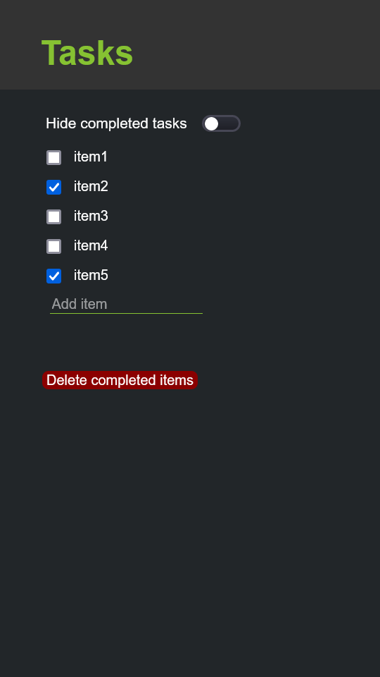

# Task List React App

This simple app allows the following functionalities: 

- Add item to a list
- Mark items that exist in the list
- Toggle between hiding marked items and the full list including these items
- Deleting marked items from the list

Here is an example of what a task list would look like with the current design:

In order to run app, clone repository, get the appropriate npm dependencies, and if using
an IDE like Webstorm, you should be able to run the app as displayed in the screenshot.

Future iterations of the app will hopefully give the user the ability to delete
individual items from the list and undo these deletes in the order they were made.