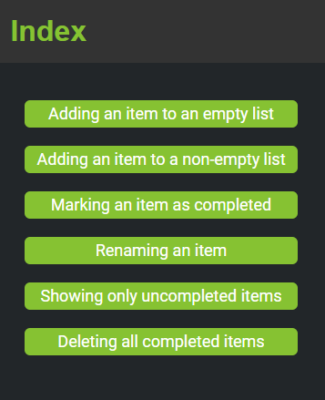
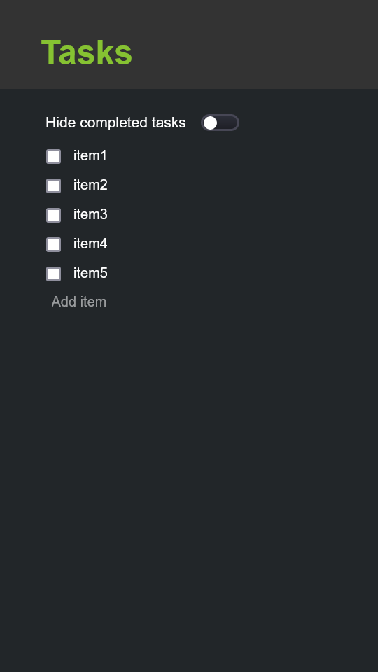
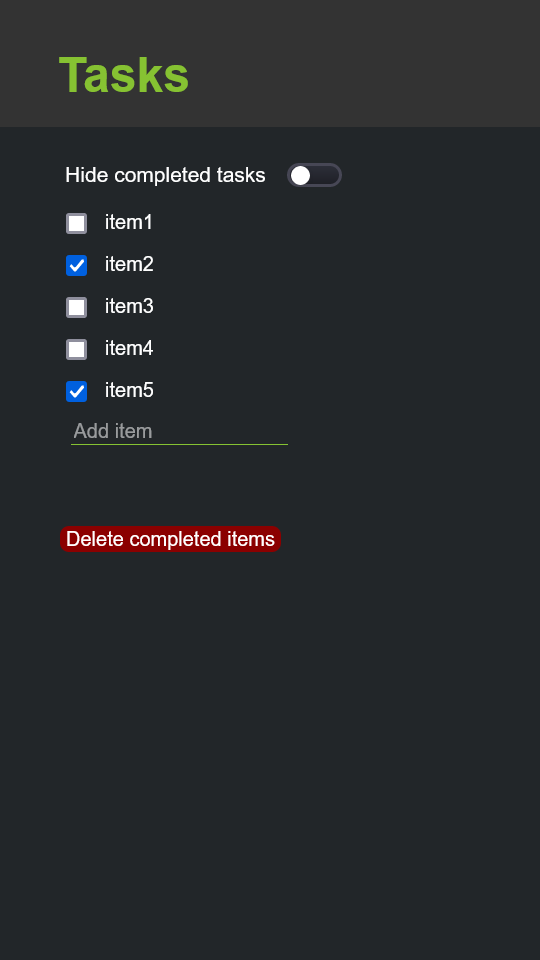
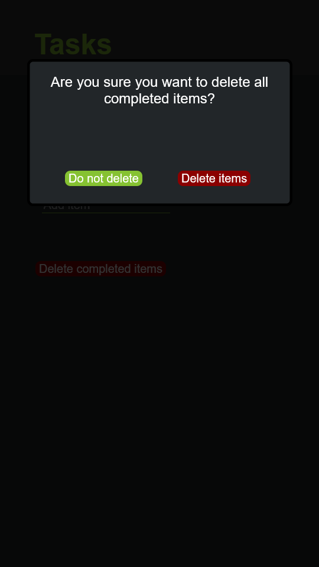
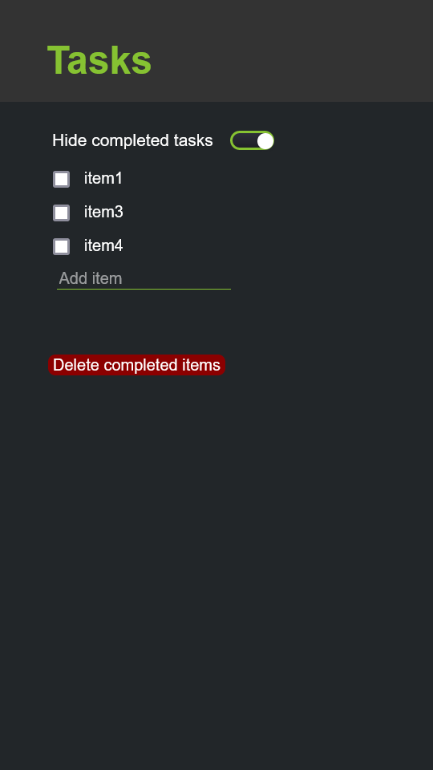

# Decisions
Here we describe different design elements that we decided on including color scheme,
icons and how these attributes fit into the design

### Color Scheme
+ \#25274D for background color
+ White for text so legibility will be easy against the black background
+ \#86C232 for header so it stands out
+ \#333 for header background color to create an aesthetically pleasing header bar
+ This scheme was inspired by color palettes \#27 on [this website](https://visme.co/blog/website-color-schemes/)

Currently, the app only supports this "dark mode" but future iterations could have different, 
potentially more accessible color schemes available

### Icons
+ Button for deleting; red so it signals something drastic is happening and data will
be eminently lost
+ Toggle for show or hide items moreso indicates modality and indicates to the user
that the action can be done and undone
+ ~~Pencil for editing. Disappears in editing more.~~
+ Checkbox for list items so they can be marked and unmarked depending on status of completion
+ Editing button for top level icon

# Alternatives
We briefly considered using different color schemes that were
brighter and more fun, but we figured it would ultimately be too
distracting. 

Previous version of our app had a walk through element organized in 6 categories by
buttons on the page as such:

Since there is no longer a walk through element, our design is much simpler. We also
got rid of some of our icons and buttons so for editing an entry, the user just clicks
on the entry itself instead of an icon; for adding one, the user just hits enter ass opposed
to a button.

# Challenges
A lot of difficulties with styling and making certain elements work. For
instance the toggle button was a lot more code than anticipated. We
also considered making the checkmarks more in tune with the color scheme
but that proved to also be more code than anticipated. 

We decided convention could be kept in this instance, preserving the
checkmark in the checkbox against the blue background. It is not especially distracting in
our design.

Ordered all the different tasks the lab asked to be completed into an index of 6 different pages,
each with a walkthrough on how the task would be performed.

Additionally with implementing more on the backend came challenges with figuring out when
to use state variable and how to access data across different components. For instance,
storing state for different configurations of the list ie completed items, total items, and 
all items except completed items. Of course, these all then need to be updated in the appropriate
places as it pertains to the task that needs to be carried out. 

We also still need to fix adding long blocks of text to the task list,
as it currently does not wrap around properly. Currently deliberating between
switching to "textarea" refactor or figuring out different ways to manipulate the input
tag within css.

# Accomplishments
The final output of our pages appears pretty accessible and it displays pretty nicely on different screens.
Some key features include:

**The plain task list itself**

**The delete button appears after an item has been marked**

**A popup when a user is about to delete completed tasks**

**Hiding completed items with the ability to still delete them
completely avaiable**

